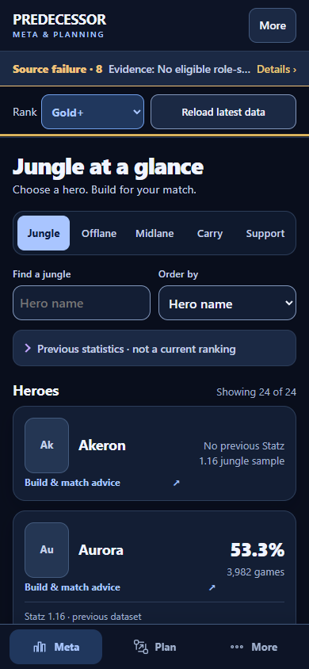
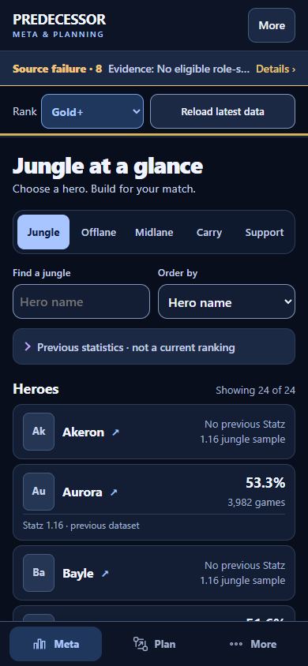
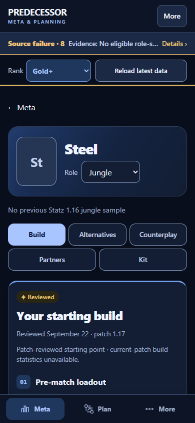
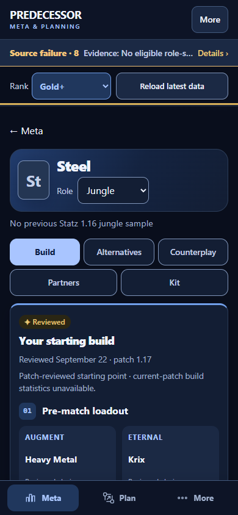
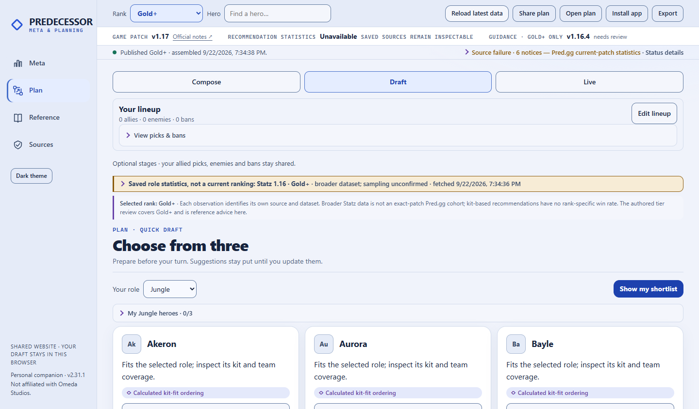

# Companion improvement — review handoff

Prepared September 23, 2026 against release 2.31.1 (`2800358`). Branch: `codex/product-companion-review`. **Preview only: no main merge, installation or production deployment.**

## What changed

- Compact phone roster rows keep every hero, sample size and previous-dataset label. Tapping the statistics or whitespace now opens the same hero as the native name button.
- Favorites and recent heroes are available in a compact disclosure above the full list; duplicates are removed from Recent. Removing a favorite does not navigate away.
- A smaller hero header and tighter spacing put the pre-match loadout earlier. Five loadout choices, six purchases, alternatives, source disclosures and skill points survive unchanged.
- Draft's three candidates use compact cards and a visible selected state. Keyboard selection moves focus to the setup heading; the heading was checked for sticky-control obstruction. Candidate stability, bans and evidence-change guards remain intact.
- Shared `docs/AI-CONTEXT.md` and an `AGENTS.md` pointer explain architecture, evidence rules, tests and release safeguards. No `CLAUDE.md` existed; no redundant copy was created.

The recommendation engine, observed figures, source dates, strategic guidance, patch corrections, collectors and production schedule are unchanged. This is not a fresh data collection or AI strategy review.

## Measured comparison

Same six saved public bundles, SHA-256 checked against their original September 23 00:36 UTC publication manifest. Baseline and changed shells read identical data and source dates. Images were deliberately unavailable in the deterministic comparison, exercising the existing initials/name fallback. This does not prove live remote-image reliability.

| Phone, 390 × 844, dark | Before | After |
|---|---:|---:|
| Jungle Meta, all 24 heroes | 4,486px | 2,998px (33% shorter) |
| Steel Jungle hero page | 2,261px | 2,135px |
| Pre-match loadout starts | y=788px | y=698px |
| Draft with three candidates | 1,554px | 1,350px (13% shorter) |

These are page-height/layout measurements, **not load-time claims**. Not every loadout part fits in the first viewport; readability and evidence labels take priority. More and Sources are intentionally unchanged.

## Local verification

| Check | Result |
|---|---|
| Python `test_static*.py` | 215 tests; OK, one existing skip |
| Node unit suites | 233 passed |
| Browser audit / evidence regressions | 146/146 passed |
| Existing visual polish | 50 checks each in Edge and WebKit; no browser errors or axe violations |
| Existing visual redesign | 50 states in Edge, both themes including 320px and short landscape; no errors or axe violations |
| Existing companion flow | 36 states in Edge; no errors or axe violations |
| New product workflow tests | Six width/theme combinations each in Edge and WebKit; no errors or axe violations |
| App update lifecycle | 11 checks passed, including preserving selections and an actual server outage |
| Offline lifecycle | All nine checks passed with six saved brackets; overlapping saves preserve their respective ranks |
| Six-bracket review preview | All six rank selections load; original dates and observed rows match baseline |
| Syntax / diff checks | Changed JavaScript parses; `git diff --check` clean |

Initial local Node invocation could not start the default `python` executable in the sandbox; reran with the installed Python runtime and all 233 passed. A local audit harness port mismatch was corrected before the successful full run. Tests are not represented as successful from those failed setup attempts.

No runtime TypeScript, lint configuration or framework production build exists. The actual static publisher was exercised with both the committed historical test seed and six checksum-verified saved public bundles. Real iPhone/home-screen acceptance, VoiceOver/NVDA and physical touch ergonomics remain **not run**.

## Visuals

Viewport captures at normal text size; full-page and additional theme/desktop captures are in the local review evidence directory.

| Before | After |
|---|---|
|  |  |
|  |  |

## Deployment / safety

The user subsequently authorized creating the `predecessor-meta` Vercel project in their free Hobby workspace, solely for protected previews. Automatic production-domain assignment is disabled; no Git integration, custom domain, paid service or main-branch deployment was configured. Deployment receipts are recorded in the pull request.

Vercel CLI 59.25.4 forced the first app deployment to Production despite an explicit `--target preview`. That deployment was immediately removed and zero deployments were verified. The user separately approved a blank setup page for the required initial production-labelled deployment. The app then deployed with the independently inspected target **Preview**. Keep the blank bootstrap to avoid re-triggering first-deployment promotion.

Hosted verification exposed a real compatibility bug: `credentials: 'omit'` on same-origin publication and app-update requests discarded Vercel's authentication cookie. Both calls now use `same-origin`; cross-origin cookies are not enabled. The existing lifecycle browser test now requires a synthetic HttpOnly login cookie on its local server. It fails on the old code at initial publication loading and exercises core/evidence loading, interface updates and real offline restart with the correction. Original source dates and statistics are unchanged.

There are no Supabase changes: this product has no relevant Supabase integration or database. Production remains GitHub Pages. The Windows installation and published datasets have not been modified. No paid API or service was used.

## Claude review focus / next decisions

1. Inspect whole-card pointer handling in `ui.js`: native child buttons must take precedence, and keyboard access must remain through the native hero button.
2. Inspect `savedHeroShortcuts` and existing disclosure/history restoration; open/remove/reopen and long translated hero/role names deserve attention.
3. Check Quick Draft focus after lazy evidence redraws, keyboard Tab order and short-height sticky behavior on a real device. Automated overlap checks are not screen-reader acceptance.
4. Review the actual Vercel project/preview receipt before calling deployment complete. No production promotion is authorized.
5. Next recommendation work should investigate the no-allies tie behavior described in `PRODUCT-REVIEW.md`; alphabetical tie-breaks and generic reasons are not strong strategic advice. Do not quietly change that policy in a CSS review.
6. Keep the existing evidence engine and static delivery. Incremental extraction of renderer overrides may be worthwhile; a React/Supabase migration has not earned its complexity.

Rollback of this preview is simply closing the review branch/preview; production has not changed. Any later release needs its normal approval, source package, install backup and independent production verification.
